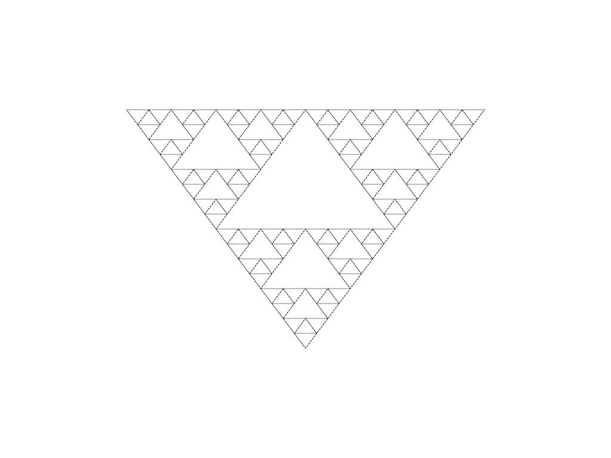
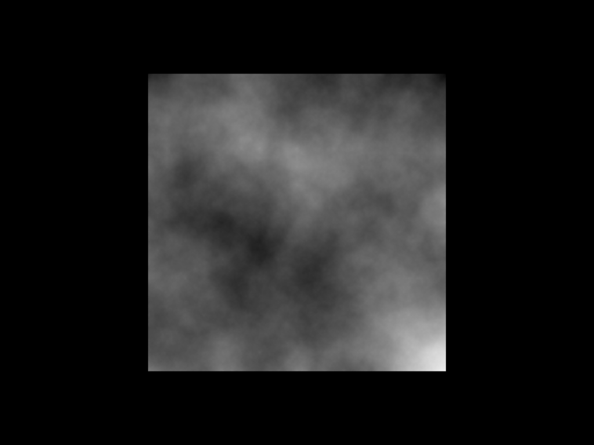

# Drawing Fractals

This repository contains a few examples of fractals drawn using the [nannou] library.

The examples were developed as part of the Computer Graphics course at the [Simon Kuznets Kharkiv National University of Economics][KhNUE].

[nannou]: https://github.com/nannou-org/nannou
[KhNUE]: https://hneu.edu.ua/en

## Pythagoras Tree


```sh
cargo run --release --bin tree
```

## Koch Curve


```sh
cargo run --release --bin curve
```

## Sierpinski Triangle



```sh
cargo run --release --bin triangle
```

## Clouds



```sh
cargo run --release --bin clouds
```
